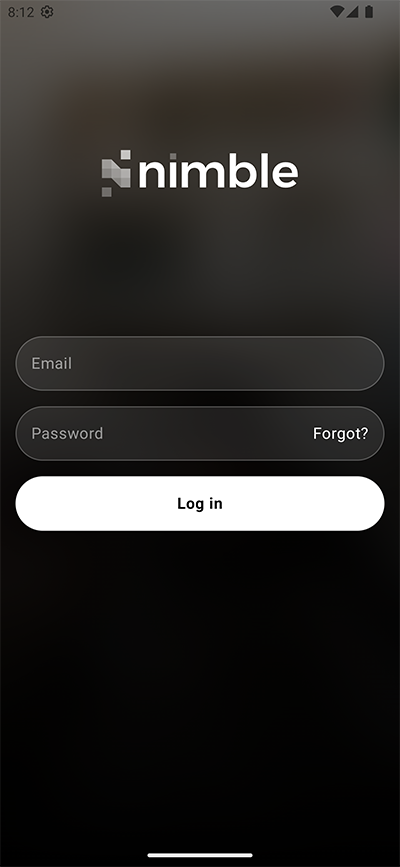
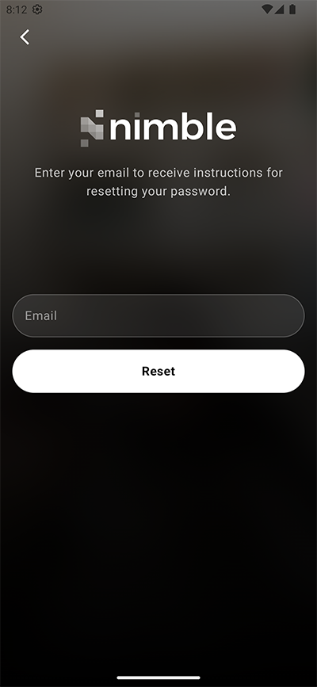
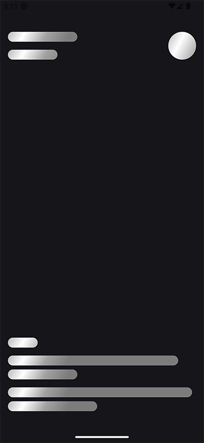
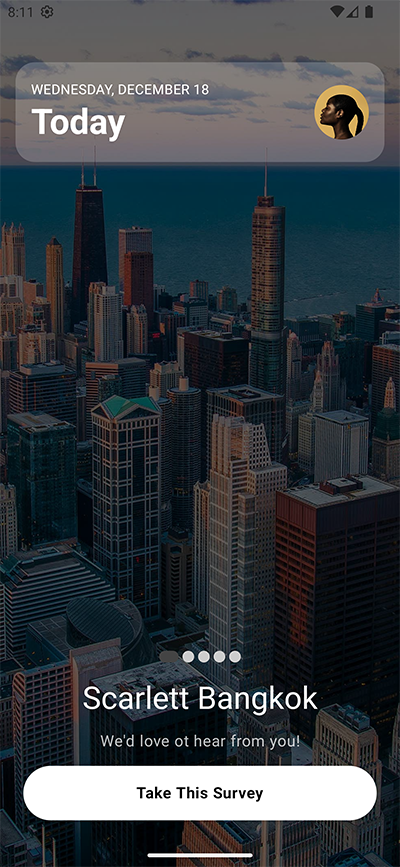
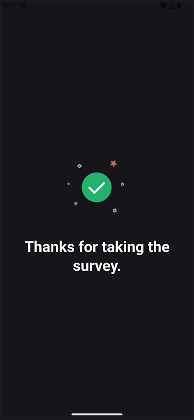

## Survey App

This project implements a survey application using the MVVM (Model-View-ViewModel) architecture. Users can view and interact with a list of surveys, including functionalities like user authentication, offline data access, and paginated survey loading.

## Screenshots

| Splash Screen | Sign In Screen |
|---|---|
|  |  |
| Reset Password Screen | Survey Loading Screen |
|  |  |
| Survey Screen | Thank You Screen |
|  |  |

## Project Requirements

**Android Studio:**

*   `compileSdk`: 35
*   `targetSdk`: 35
*   `minSdk`: 23

**Build Tools:**

*   `gradle`: 8.9
*   `kotlin`: 2.1.0

**JDK:**

*   `jdk`: 17

This project utilizes Gradle JDK 17 for its build process, ensuring compatibility and leveraging the latest language features.

[Image of Gradle settings showing JDK 17](screenshots/android_studio_jdk_version.png)

**Reviewer Note:** Please ensure your Android Studio is configured to use JDK 17 for this project to avoid potential build issues. You can check and modify your JDK settings in Android Studio.

## Architecture

The app adheres to a modular MVVM structure, separating concerns into distinct layers:

- **App Module:** Provides dependencies for other modules (use cases, repositories, data sources).
- **Data Module:** Handles data-related operations (network requests, local database interactions, data mapping).
- **Domain Module:** Encapsulates core business logic (use cases, repository interfaces).
- **Presentation Module:** Manages the UI and user interactions (Jetpack Compose).

## Technologies

* **Language:** Kotlin
* **Architecture:** MVVM (Model-View-ViewModel)
* **Dependency Injection:** Dagger Hilt
* **Reactive Programming:** Kotlin Coroutines and Flow
* **UI:** Jetpack Compose
* **Navigation:** Compose Navigation
* **Local Database:** Room
* **Data Storage:** Proto DataStore (with [Tink](https://github.com/tink-crypto/tink) encryption and Android Jetpack Security Key Management)
* **Networking:** Retrofit and OkHttp
* **Paging:** Room Paging Library and Compose Paging
* **Testing:** Unit Tests (covering data, domain, and presentation layers)

## Modules

**1. App Module**

Provides dependencies for other modules. Contains a `di` package with:

* `AppModule`: Application-level dependencies (Context, KeysetManager).
* `DataModule`: Data layer dependencies (local data sources, Gson, OkHttp, Retrofit, Room database, Room DAO).
* `DomainModule`: Domain layer dependencies (Use Cases, Repositories).
* `MainActivity` resides here and manages navigation using Compose Navigation.

**2. Data Module**

Handles data operations. Key components include:

* **Data Sources:**
    * **Local:** Room database for persistent storage, Proto DataStore for encrypted user credentials (access token, refresh token) using Tink library and Android Jetpack Security for key management. Proto DataStore offers advantages over SharedPreferences (type safety, data consistency, asynchronous operations, efficient persistence, error handling).
    * **Remote:** Retrofit and OkHttp for network communication (APIs with and without authentication).
    * **Mediator:** `SurveyRemoteMediator` handles paging for Room, fetching data from the remote API when needed and caching it locally.
* **Data Models:** Represent data structures retrieved from sources.
* **Data Mappers:** Map data models to domain models.
* **Repository Implementations:** Implement the repository interfaces defined in the domain layer.
* **AuthInterceptor:** Manages authentication and token refresh:
    - Adds "Authorization" header with Bearer token.
    - Refreshes expired access tokens using the refresh token.
    - Retries failed requests with a new token.
    - Handles logout scenarios and prevents concurrent refresh attempts.
    - Provides a mechanism to bypass authentication for specific requests using custom headers.
* **Offline-first architecture:** data is retrieved from the local database first. If unavailable, it's fetched from the server and cached locally.

**3. Domain Module**

Contains core business logic, defining:

* Repository Interfaces
* Use Case classes
* Domain Models
* Domain Mappers

**4. Presentation Module**

Manages UI and user interactions, containing:

* Jetpack Compose functions
* ViewModel classes
* Compose Navigation

## Screens

* **Splash Screen:** Displays the Nimble logo with a fade animation (3.5 seconds) before navigating onwards.
* **Sign In Screen:** Allows users to log in with email and password. Includes email validation and error handling. Navigates to the Home screen upon successful login.
* **Reset Password Screen:** Allows users to request a password reset via email.
* **Home Screen:** Displays a paginated list of surveys using a pager view. Each survey has a cover image, name, description, date, and a "Survey" button. Implements offline-first architecture and uses Room Paging Library and Compose Paging for efficient data loading.
* **Thank You Screen:** A simple screen displayed after tapping the "Survey" button, automatically navigating back to the Home screen after 5 seconds.

## Testing

Unit tests cover the data, domain, and presentation layers, ensuring code quality and reliability.

## Data Storage Security

The use of Proto DataStore with Tink encryption and Android Jetpack Security provides robust security for sensitive data like access and refresh tokens. This combination addresses key security concerns:

* **Secure Storage:** Proto DataStore provides a type-safe and efficient way to store data.
* **Encryption:** Tink library provides robust cryptographic primitives to encrypt the data at rest.
* **Key Management:** Android Jetpack Security provides secure key storage and management, protecting the encryption keys.

This comprehensive overview of the Survey App's architecture and implementation should

## Further Considerations

This project demonstrates a robust and well-structured approach to building Android applications using modern technologies and best practices. Key aspects to highlight include:

*   **Offline-First Architecture:** The application prioritizes local data access, providing a seamless user experience even with limited or no network connectivity. This is achieved through the use of Room for local data storage and a `RemoteMediator` for efficient data synchronization.
*   **Secure Data Storage:** Sensitive user data, such as access and refresh tokens, is securely stored using Proto DataStore, encrypted with the Tink library, and managed with Android Jetpack Security's KeysetManager. This combination ensures a high level of data protection.
*   **Robust Authentication:** The `AuthInterceptor` handles authentication and token refresh seamlessly, improving security and user experience. It manages token expiration, refresh attempts, and prevents concurrent refresh operations, handling various authentication scenarios.
*   **Efficient Data Loading:** The use of Room Paging Library and Compose Paging enables efficient loading and display of large datasets of surveys, enhancing performance and user experience.
*   **Modular Architecture:** The project's modular architecture (app, data, domain, presentation) promotes code organization, maintainability, and testability. This separation of concerns simplifies development and collaboration.
*   **Modern Technologies:** The project leverages modern Android development tools and libraries, including Kotlin, Jetpack Compose, Dagger Hilt, Kotlin Coroutines, and Flow, ensuring the application is built with current best practices.
*   **Testability:** The project is designed with testability in mind, with unit tests covering the data, domain, and presentation layers. This ensures code quality and reduces the risk of regressions.
*   **Proto DataStore Advantages:** The choice of Proto DataStore over SharedPreferences is deliberate, offering significant advantages in terms of type safety, data consistency, asynchronous operations, efficient persistence, and robust error handling.

This project serves as a solid foundation for building scalable and maintainable Android applications. The emphasis on security, offline functionality, and efficient data handling makes it well-suited for real-world applications.
